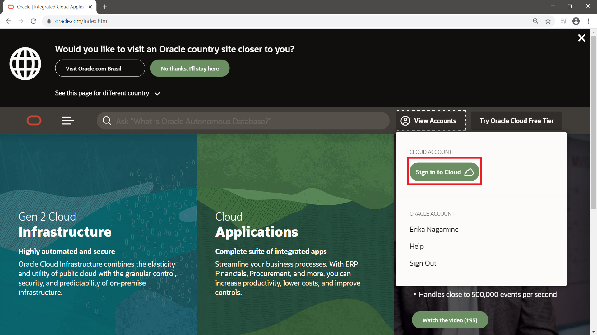

    #     ___  ____     _    ____ _     _____
    #    / _ \|  _ \   / \  / ___| |   | ____|
    #   | | | | |_) | / _ \| |   | |   |  _|
    #   | |_| |  _ < / ___ | |___| |___| |___
    #    \___/|_| \_/_/   \_\____|_____|_____|
***

# Autonomous Database

Oracle Autonomous database is an inovative platform for data, including for transaction and analytics data.

During this time, we will construct a integrated data platform with a transaction application and analytics application.

The main topics that we will execute during this time is:

1. [ Accessing the Oracle Public Cloud ](#1)
2. Setup base Environment
3. Provisioning Autonomous Transaction Processing (ATP)
4. Provisioning Autonomous Data Warehouse (ADW)
5. Provisioning Oracle Analytics Cloud (OAC)
6. Create an application on APEX
7. Import data from object storage
8. [ Creating a dashboard on OAC ](#8)

<a name="1"></a>
# 1. Accessing the Oracle Public Cloud
On your web browser, visit the oracle [site](http://www.oracle.com "Oracle Official Site")


On Oracle website, go to "View accounts":


On "View Accounts" click in "Sign in to cloud":





<!-- blank line -->
----
<!-- blank line -->
<a name="2"></a>
# 2. Setup base Environment

<!-- blank line -->
----
<!-- blank line -->
<a name="3"></a>
# 3. Provisioning Autonomous Transaction Processing (ATP)
asdasd

<!-- blank line -->
----
<!-- blank line -->
<a name="4"></a>
# 4. Provisioning Autonomous Data Warehouse (ADW)

<!-- blank line -->
----
<!-- blank line -->
<a name="5"></a>
# 5. Provisioning Oracle Analytics Cloud (OAC)

<!-- blank line -->
----
<!-- blank line -->
<a name="6"></a>
# 6. Create an application on APEX

<!-- blank line -->
----
<!-- blank line -->
<a name="7"></a>
# 7. Import data from object storage

<!-- blank line -->
----
<!-- blank line -->
<a name="8"></a>
# 8. Creating a dashboard on OAC

<!-- blank line -->
----
<!-- blank line -->

```
::: sql
%sql
dbms_cloud.Create_credential (credential_name => v_credencial, username => v_usuario, password => v_senha); 

```

