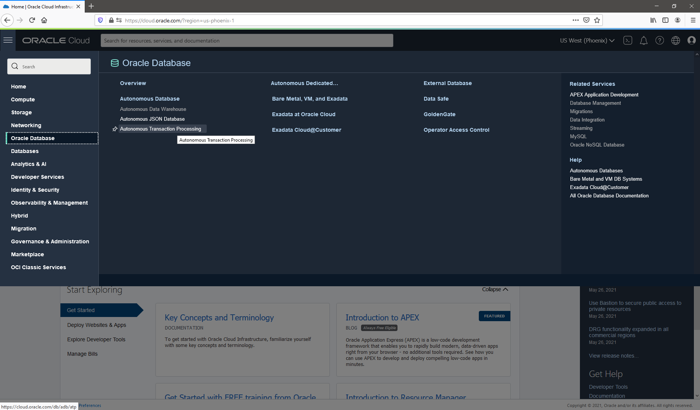
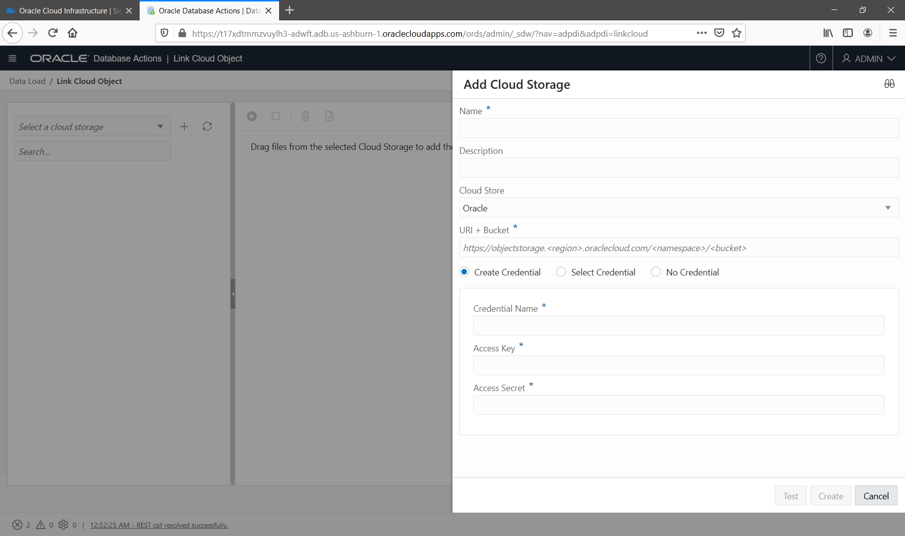

    #     ___  ____     _    ____ _     _____
    #    / _ \|  _ \   / \  / ___| |   | ____|
    #   | | | | |_) | / _ \| |   | |   |  _|
    #   | |_| |  _ < / ___ | |___| |___| |___
    #    \___/|_| \_/_/   \_\____|_____|_____|
***

# Autonomous Database

Oracle Autonomous database is an inovative platform for data including transactional data, relational, nosql and analytical.

During this time, we will construct a integrated data platform with a transaction application and analytics application.

The main topics that we will execute during this time is:

<a name="#top">Menu:</a>

1. [ Accessing the Oracle Public Cloud ](#1)
2. [ Setup your environment ](#2)
3. [ Provisioning Autonomous Transaction Processing (ATP) ](#3)
4. [ Provisioning Autonomous Data Warehouse (ADW) ](#4)
5. [ Provisioning Oracle Analytics Cloud (OAC) ](#5)
6. [ Create an application on APEX ](#6)
7. [ Loading data to ADW Using Database Actions: Database (ATP) ](#7)
8. [ Loading data to ADW Using Database Actions: Data Lake (Object Storage) ](#8)
9. [ Oracle Machine Learning ](#9)
10. [ Get insights with your data in OML Notebooks ](#10)
11. [ Creating a dashboard on OAC ](#11)

<a name="1"></a>
# 1. Accessing the Oracle Public Cloud
On your web browser, visit the oracle [site](http://www.oracle.com "Oracle Official Site")


On Oracle website, go to "View accounts":


On "View Accounts" click in "Cloud Account" -> "Sign in to cloud":


On "Sign in" page, put the information about your cloud account:


Insert your tenant name here:


Then click in next:


At this moment you need to inform your account and password:


Then click in next:


On Console page, you have the menu on the left top of the screen:


Menu contains all those services that you can use on cloud.

Also you have on the top of your screen the region that you are logged in: 


And you have your profile configuration on the top right of main page


<!-- blank line -->
----
<!-- blank line -->

[ Return to top ](#top)


<a name="2"></a>
# 2. Setup your environment

## Create a compartment
First you need to create the compartment. To create your compartment, click on menu -> identity -> Compartment


Then click in create compartment:


Put your information about your compartment:


Then click in create.

## Upload files

Second step we will upload the necessary files for this workshop.

We will create a bucket into an object storage.

To create an object storage bucket, click in menu -> Object Storage -> Object storage


Make sure that you are in the right compartment:


Then click in "Create bucket":


On the bucket creation page, insert the name of desired bucket:


And then click "create bucket":


Check if your bucket has been created:


Click on your created bucket:


>> Download files for this workshop:

>> <a href="https://github.com/erikanagamine/autonomousdatabase/raw/master/files/geonames.json" target="_geonames">geonames.json</a>

>> <a href="https://github.com/erikanagamine/autonomousdatabase/raw/master/files/Global_Landslide_Catalog_Export.csv" target="_landslide">Global_Landslide_Catalog_Export.csv</a>


PS: file Sources - Reference:
<a href="https://catalog.data.gov/dataset/global-landslide-catalog-export" target="_vendas">Nasa - Global Landslide</a>

<a href="https://www.geonames.org/" target="_vendas">Geonames.org</a>


On your bucket page, click in "Upload Objects":


On upload page, select the folder or drag and drop the downloaded files:


Then click close:


Check if files was download correctly:


<!-- blank line -->
----
<!-- blank line -->

[ Return to top ](#top)


<a name="3"></a>
# 3. Provisioning Autonomous Transaction Processing (ATP)

In this session we will provision an Autonomous Transaction Processing Database. This database is designed for OLTP.

So, to start the provision, go to menu -> Databases -> Autonomous Transaction Processing:



Check if you are on the right compartment:


Then Click in "Create Autonomous Database"


On the creation page:


Check if the follow information was filled:
- Compartment: <check if is correct>
- Display name: <put an name - Example: atpft>
- Database name: <put an name - Example: atpft>
- Choose the workload type: in this case Transaction Processing
- Choose deployment type: Shared infrasctructure


Continue choosing this options:
- No Always Free option
- Choose database version: 19c
- OCPU Count: 1
- Storage (TB): 1
- No auto scaling
- Choose the admin Password that you want


Options that you need to choose:
- Allow Secure access from everywhere
- Choose licensing type: Byol

And then click in "Create autonomous database":


During creation process time, you will see the amber color of word "ATP":


When the process finish, the work ATP will change to green:


<!-- blank line -->
----
<!-- blank line -->

[ Return to top ](#top)


<a name="4"></a>
# 4. Provisioning Autonomous Data Warehouse (ADW)

In this session we will provision an Autonomous Data Warehouse Database. This database is designed for DW.

So, to start the provision, go to menu -> Databases -> Autonomous Data Warehouse:


Check if you are on the right compartment:


Then Click in "Create Autonomous Database"


On the creation page:


Check if the follow information was filled:
- Compartment: <check if is correct>
- Display name: <put an name - Example: adwft>
- Database name: <put an name - Example: adwft>
- Choose the workload type: in this case Data Warehouse
- Choose deployment type: Shared infrasctructure


Continue choosing this options:
- No Always Free option
- Choose database version: 19c
- OCPU Count: 1
- Storage (TB): 1
- No auto scaling
- Choose the admin Password that you want


Options that you need to choose:
- Allow Secure access from everywhere
- Choose licensing type: Byol

And then click in "Create autonomous database":


During creation process time, you will see the amber color of word "ADW":


When the process finish, the work ADW will change to green:


<!-- blank line -->
----
<!-- blank line -->

[ Return to top ](#top)


<a name="5"></a>
# 5. Provisioning Oracle Analytics Cloud (OAC)

In this section, we will provision the Oracle Analytics Cloud, aka. OAC.

PS. You can download Oracle Analytics Desktop if you are executing in a always free tenant. <a href="https://www.oracle.com/solutions/business-analytics/analytics-desktop/oracle-analytics-desktop.html"> Click here </a> to download (necessary your OTN login)

First, you need to provision the OAC. So on menu, click on "Solutions and Platform" -> Analytics -> Analytics Cloud:


Make sure that you have select the right compartment (on the left), and then click on "Create Instance"


Input the follow information on the analytics:
- INSTANCE NAME: oac
- DESCRIPTION: My OAC instance
- FEATURE SET: Enterprise Analytics
- CAPACITY: OCPU - 1
- LICENSING: BYOL


Then click in "Create".


After click in create, the OAC will be provisioned:


You can go ahead on next lessons, because the creation will take few minutes.


<!-- blank line -->
----
<!-- blank line -->

[ Return to top ](#top)


<a name="6"></a>
# 6. Create an application on APEX

In this step we will create an application based on a spreedsheet in APEX. Oracle Application Express (APEX) is a low code development tool that can enables you to built an application with few steps.

Before start this step, download this file:

>> Download file to proceed in this step:

>> <a href="https://raw.githubusercontent.com/erikanagamine/autonomousdatabase/master/files/citizen.csv" target="_citizen">citizen.csv</a>

We have 2 ways to access APEX: Via Autonomous Database Service or APEX Services.

In this workshop, we will access via APEX Services. So you need to click menu "database related Services" on "APEX Application Development -> APEX Instances"


Note that you have 2 APEX services. This services is related to the ADBs created in previous sections. So click on the ATP service on APEX:


And then click in "Launch APEX":


PS. also you can access the same page on  Autonomous service -> "Service Console" -> Development -> Oracle APEX in Autonomous Console or Autonomous service -> "Tools" -> "APEX"

On the first access on APEX, insert the admin password:


And then click on "Sign in to Administration":


Now we have to create the workspace for our application. Workspace is a shared logical space for your application.

Click in create workspace:


On the creation page, you will need to insert an information:


Input the follow information on the APEX Workspace:
- Database User: citizen
- Password: Choose the admin Password that you want
- Workspace name: citizen

Then click in "Create Workspace".


If your workspace has been create, you should see a message on the top of page:


Click on the created workspace:


On the workspace login page:


Insert the password that you choose for your workspace and then click in "Sign in":


On the main page of your workspace:


Click in "app builder":


On the creation app page:


Click in "Create an new app":


Click in "From a file":


Drag and drop the file that you have download on beginning of this step:


Now the APEX will read the file:


Insert the name of table as "resident_registry":


Review the information and check the parsed information.


And then click on "Load Data". If everything works fine, you will se the follow information:


Click on "Create Application".


On the create application page, click in "add page":


And then, click in "Interative Grid":


On the Interative grid page , insert the page name as "residents register page" and select the table that contain all data:


Take a look that your form has been create as a page:


Check all features in this page:


And then, Click in create application:


After load, you sucessfully create your first application:


Execute your application in "Run Application":


On your application page, insert the user / password of your application and then click in "Sign in":


Notice that your application has the "residents register page", so click on that:


You can insert new customers on your grid:


And you can check some dashboards created by default:


So, now you can explore more APEX and create more applications :)


<!-- blank line -->
----
<!-- blank line -->

[ Return to top ](#top)

<a name="7"></a>

# 7. Loading data to ADW Using Database Actions: Database (ATP)

At this time we will use the SQL Developer Web (via on Database Actions console) on ADW to connect ATP database.

First we have to copy the ATP wallet to object storage.

On SQL Developer Web, we will load data from files load into object storage. This activity needs an auth token.

## Generate a token to connect your database with files on bucket

In this section we will generate a token to connect the files on object storage with autonomous database.

First access your user data, on the top of screen, click on profile and click on your user:


Click in "Auth token" (menu at left of your screen) and then Click on "Generate token":


Save this generated token into a file.


PS: This token is generated once per time. If you lose this token, you need to create another one.


# Generate a wallet on ATP

On ATP main page, click in "DB Connection":


You need to select wallet type as "Instance Wallet" and then click in "Download Wallet":


So, then insert a password to download the wallet and then click in download:


Notice that wallet was a tnsnames, wallet, etc. files.

Decompress the wallet file and get the file called "cwallet.sso":


Now you have to insert the "cwallet.sso" to the bucket. The step by step how can you create a bucket and insert files was describe in step 2:


# Create credential to load atp wallet to object storage in OCI

First connect to the Database actions on ADW and click in "Tools":


Select "Open Database Actions" tool:


Insert your admin username then click in "next":


Insert your admin password then click in "Sign in":


This is the database actions central console. We will click on SQL to create the credential. Credential is neeed for create a connection between Object Storage and Autonomous Database.


So, click in SQL:


In the first time that you access the sqldeveloper web console you will see some tips that inform you how to use the environment.


In this page, the queries can be executed insert the code on (1) and running click in (2) that shows a tabular view or (3) in script view:


Now you can edit and copy the information below with your information and execute on SQL Developer Web, using "Run Script" button or F5:

```
-- Create credential
DECLARE 
    v_credential VARCHAR2(100) := 'OCI_CLOUD_STORAGE_CRED'; -- choose the name of your preference
    v_user       VARCHAR2(100) := '<insert your user>'; -- insert here your user, on menu Identity -> Users -> User Details or profile (on the top of your page) -> username (example: oracleidentitycloudservice/myuser@mycompany.com)'; 
    v_password   VARCHAR2(100) := '<insert your token>'; -- on your user page, click in Auth Tokens -> generate Token example: 'h<fMHJiGKVvvgl2uz0[Q';
BEGIN 
  BEGIN
    dbms_cloud.Drop_credential(credential_name => v_credential); 
  EXCEPTION 
    WHEN OTHERS THEN
      null;
  end;
  BEGIN 
          dbms_cloud.Create_credential (credential_name => v_credential, 
                                        username => v_user, 
                                        password => v_password); 
      END; 
END;
/ 
```

If you execute sucessfully, you hit the message below:


PS. If you receive the message "ORA-20000: ORA-29283: invalid file operation: nonexistent file or path [29434]..." regenerate your token.


Now we can connect download the wallet from ATP to ADW:

```
DECLARE
  v_region      varchar2(30) :=    '<your region>'; --'insert here a region, exemple us-ashburn-1';
  v_namespace   varchar2(30) :=    '<your namespace>'; --'console cloud-> Object Storage -> Bucket Details-> <namespace>';
  v_bucket      varchar2(30) :=    '<your bucket>'; --'console cloud-> Object Storage -> Bucket Details exemple: Workshop_Object';
  v_credential  VARCHAR2(100) := 'OCI_CLOUD_STORAGE_CRED';
  v_url         varchar2(4000);

BEGIN
  v_url := 'https://objectstorage.'||v_region||'.oraclecloud.com/n/'||v_namespace||'/b/'||v_bucket||'/o/cwallet.sso';
  
DBMS_CLOUD.GET_OBJECT(
credential_name => v_credential,
object_uri => v_url,
directory_name => 'DATA_PUMP_DIR');
END;
/

```


# Create credential to access the database via Database Link (DBlink)

Warning: in this step the credential was the database user / password from source database ATP to connect ADW instance, not the token:

```

DECLARE
  v_db_usr           varchar2(30) :=    '<your db username >'; --database username, for example ADMIN
  v_password_db_usr  varchar2(30) :=    '<your db Password>'; -- password for database connection
  v_credential_db    varchar2(30) :=    '<your db credential name >'; -- database credential name, for example:DB_LINK_CRED_ATP
BEGIN
  BEGIN
    dbms_cloud.Drop_credential(credential_name => v_credential_db); 
  EXCEPTION 
    WHEN OTHERS THEN
      null;
  end;

DBMS_CLOUD.CREATE_CREDENTIAL(
credential_name => v_credential_db,
username => v_db_usr, 
password => v_password_db_usr
);
END;
/

```


Now you can create the database link to ATP. Most of those information you can check in the tnsnames.ora that you download previosly.

PS: the tnsnames contain the information that you need below such as service name, ssl certificate and the region. Choose the best service:


Now, replace the information that you found on tnsnames on the block below:

```
DECLARE
  v_database_link   varchar2(30)  :='< your database link name > '; -- your database link name, for example: ATP_LINK
  v_hostname        varchar2(1000) :=    '<your hostname>'; --'insert here your hostname, example adb.us-ashburn-1.oraclecloud.com';
  v_credential_db   varchar2(100) :=    '<your db credential name >'; -- database credential name, for example:DB_LINK_CRED_ATP
  v_service_name    varchar2(100) := '<your service name from tnsnames>'; -- tnsnames service name, for example: t17xdtmmzvuylh3_atpft_low.adb.oraclecloud.com
  v_cert_ssl        varchar2(1000) := '<certificate in tnsnames>'; -- your certification in TNSNAMES: example CN=adwc.uscom-east-1.oraclecloud.com,OU=Oracle BMCS US,O=Oracle Corporation,L=Redwood City,ST=California,C=US
  v_db_port         varchar2(10)   := '< tnsnames db port >'; -- your db port in tnsnames
  
BEGIN
   BEGIN
	   DBMS_CLOUD_ADMIN.DROP_DATABASE_LINK(db_link_name => v_database_link );
   EXCEPTION
     WHEN OTHERS THEN
       NULL;
   END;

  BEGIN
    DBMS_CLOUD_ADMIN.CREATE_DATABASE_LINK(
      db_link_name => v_database_link,
      hostname => v_hostname,
      port => v_db_port,
      service_name =>   v_service_name,
      ssl_server_cert_dn => v_cert_ssl,
      credential_name => v_credential_db,
      directory_name => 'DATA_PUMP_DIR');
  END;
END;
/

```


Execute a query to test the connection to ADW:

```
select * from all_objects@ATP_LINK where owner='CITIZEN';

```


Execute a query to test the connection to ATP (observe that we insert the information about table load on APEX):

```
select * from all_tables@ATP_LINK where table_name='RESIDENT_REGISTRY' and owner='CITIZEN';

```


Now you can access data between ATP in ADW!!!


<!-- blank line -->
----
<!-- blank line -->

[ Return to top ](#top)


<a name="8"></a>

# 8. Loading data to ADW Using Database Actions: Data Lake (Object Storage)

On database actions, we will load data from files load into object storage. This activity needs an auth token. This auth token can be the same as used in the previous task.

You need to use your ADW for this steps.

## Generate a token to connect your database with files on bucket

In this section we will generate a token to connect the files on object storage with autonomous database. 

First access your user data, on the top of screen, click on profile and click on your user:


Click in "Auth token" (menu at left of your screen) and then Click on "Generate token":


Save this generated token into a file.


PS: This token is generated once per time. If you lose this token, you need to create another one.


## Upload bucket files on SQL Developer Web


First we need to access the SQL Developer Web in ADW. So, to access this tool, go to menu -> Databases -> Autonomous Data Warehouse -> tools -> database actions

First connect to the Database actions on ADW and click in "Tools":


Select "Open Database Actions" tool:


Insert your admin username then click in "next":


Insert your admin password then click in "Sign in":


This is the database actions central console. We will click on SQL to create the credential. Credential is neeed for create a connection between Object Storage and Autonomous Database.


# Create credential to load data from object storage

This step is the same of [ Step 7: connect database via Dblink ](#7).

If you already did the token generation + create OCI CLOUD Storage Credential, you don't need to do it again.

So, go ahead with next steps.

# Load data via database actions


On database actions central console click in "Data Load":


On data load page you have two methods get the data:
- Load data you will load the data to autonomous. This is good if you have a frequency data access in the autonomous.
- Link Data: This option is for data that you need to access and doesn't store in autonomous.

Also you have this 3 methods to receive source data on autonomous:
- local file: if you need to load a file from your computer, you choose this option
- database: if you need to load data from another database to autonomous, you can choose this option.
- Cloud Storage: if you need to load data from a cloud storage (OCI object storage you choose this option)


In this time we will use files that we store on Object storage in the step 2 [ Return to step 2 ](#2) :
- geonames.json: we will access via link data option
- Global_Landslide_Catalog_Export.csv: we wiil load data

# Load data from object storage into autonomous database via Database Actions as link data

At this time we will load geonames.json file stored on Object Storage via link data option. So in the Data load page select link data -> cloud storage and then next.


In the link cloud object page you will see a message to setup cloud storage. So, click in OK


On setup cloud storage you will see this page:



So add the follow information to load the data:
- name: name of job
- Cloud Storage: Oracle
- URI+Bucket: your cloud storage, example: https://objectstorage.us-ashburn-1.oraclecloud.com/n/<namespace>/b/<name of bucket>/o/ -- you can get this information on bucket page
- Credential: select credential -> choose the credential that you insert in the activities before. 

and then click in test:


click in create:


Note that you found the json file that you store on the object storage. So click in the file and drag to the other screen:


Edit the job (in pencil icon) before click in play and modify all fields to varchar2(4000) as image below:


Click in play:


and ok to execute the job:


Now check the progress of job


If everything run sucessfully, you will see the check in the job as below:


Now you can see the view geodata in the sql developer web option:


# Load data from object storage to autonomous database via Database Actions as load data to autonomous storage

To load data from object storage to autonomous in Database Actions, click in load data -> cloud storage and then next:


Drag the landslide file:


And then click in play:


click in ok to run the job:


Check the progress of job (it will take a minute to load):


If everything is good on running job, you see the message below:


Now you can see the dataset table load in the sql developer web option:


Grant tables and create synonym to public:

```
grant select on GLOBAL_LANDSLIDE_CATALOG_EXPORT to public;
grant select on geonames to public;

create public synonym GLOBAL_LANDSLIDE_CATALOG_EXPORT for admin.GLOBAL_LANDSLIDE_CATALOG_EXPORT;
create public synonym geonames for admin.geonames;

```


<!-- blank line -->
----
<!-- blank line -->

[ Return to top ](#top)

<a name="9"></a>

# 9. Oracle Machine Learning

The Oracle Machine Learning is an Apache Zeppelin notebook that can help you to know your data.

At this time we will create an user for this tool and can be used in ADW or ATP.

In this workshop, we will create on ADW. Select your ADW on menu page:


In the ADW page, select your ADW:


Click on "tools" tab:


Then click on "Oracle ML User Administration": 


On the ML administration page, insert admin as username and the password that you create for admin on ADW creation:


Then click in "Sign In":


On the ML user administration main page, click in "create" 


Insert data from your user:


Then click in create:


Check if your user has been created:


PS: remember the user create and password. You will use this on step 10.

<!-- blank line -->
----
<!-- blank line -->

[ Return to top ](#top)

<a name="10"></a>

# 10. Get insights with your data in OML Notebooks

If you need to see your data in another visualization using notebooks, you can use Oracle Machine Learning.

Oracle Machine Learning is a platform that possibility you discover your data without necessity of another tool.

On ADW console, click in "Service Console":


On service console, click in "Development":


Under development tab, click in "Oracle Machine Learning Notebooks":


Insert your user data (as you do on step 7):


Then click "Sign In":


On the main page of OML Notebooks, let's create our own notebook:


Click in notebooks:


On notebooks page, click in "Create":


On creation page, insert a name for your notebook, then click ok:


On notebook page, you can explore more your data:


Execute this in script mode:
```
%script

select * from geonames

```


Execute this select in sql mode:

```
%sql

select * from GLOBAL_LANDSLIDE_CATALOG_EXPORT

```


Notice that we have more options to visualize data in SQL:


Tip: there is a lots of examples of using OML. Please check in the example page inside the notebook. Also you can use python:


<!-- blank line -->
----
<!-- blank line -->

[ Return to top ](#top)


<a name="11"></a>

# 10. Creating a dashboard on OAC

Before create a dashboard you need to connect your Database instance to the OAC. To connect your instance in OAC, go to OAC Page:


And then click on "Open URL":


So, on the OAC page, click in create:


and then, click in "Connection":


Select the property connection for ADW (autonomous data warehouse):


Input your connection information:


and then click in save:


So, now you have sucessfully connect your ADW with your OAC! :-)


<!-- blank line -->
----
<!-- blank line -->

[ Return to top ](#top)


