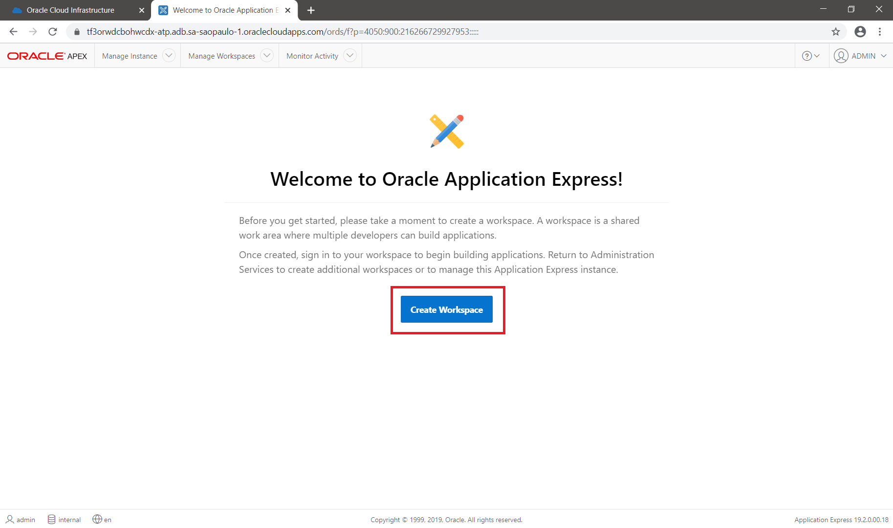
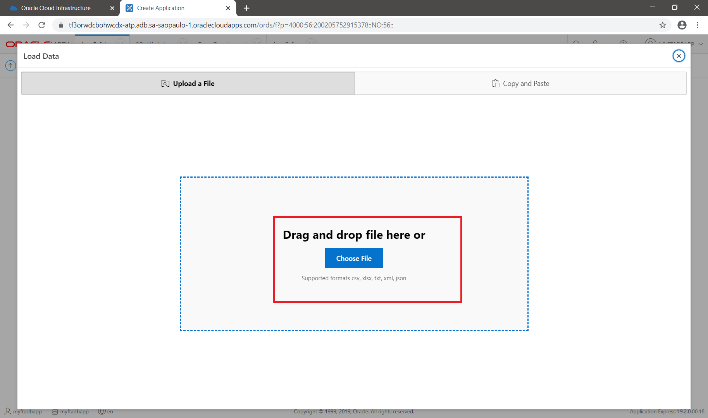
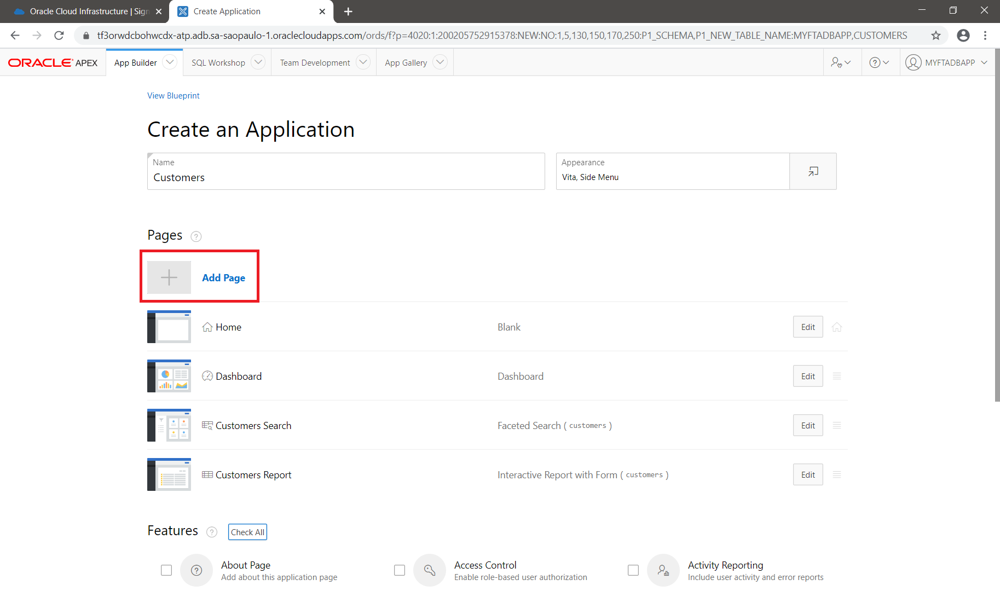
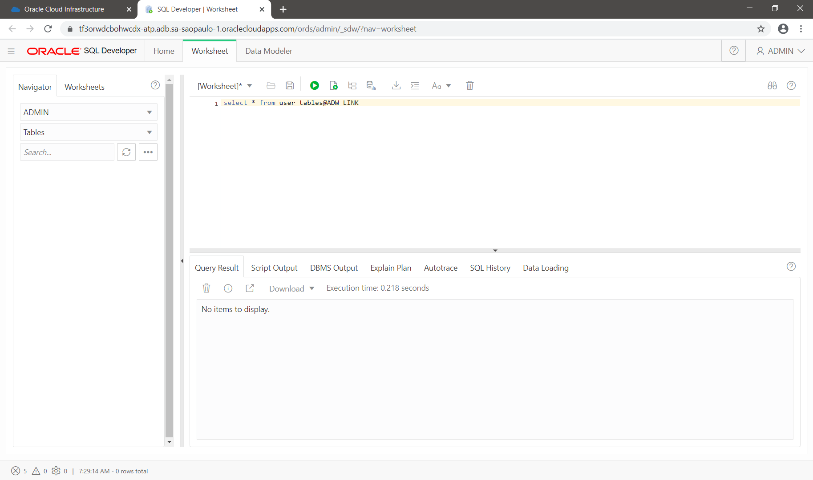
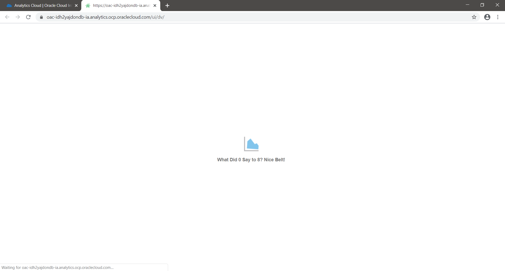

    #     ___  ____     _    ____ _     _____
    #    / _ \|  _ \   / \  / ___| |   | ____|
    #   | | | | |_) | / _ \| |   | |   |  _|
    #   | |_| |  _ < / ___ | |___| |___| |___
    #    \___/|_| \_/_/   \_\____|_____|_____|
***

# Autonomous Database

Oracle Autonomous database is an inovative platform for data including transactional data, relational, nosql and analytical.

During this time, we will construct a integrated data platform with a transaction application and analytics application.

The main topics that we will execute during this time is:

<a name="#top">Menu:</a>

1. [ Accessing the Oracle Public Cloud ](#1)
2. [ Setup your environment ](#2)
3. [ Provisioning Autonomous Transaction Processing (ATP) ](#3)
4. [ Provisioning Autonomous Data Warehouse (ADW) ](#4)
5. [ Provisioning Oracle Analytics Cloud (OAC) ](#5)
6. [ Create an application on APEX ](#6)
7. [ Create an connection Between ATP and ADW ](#7)
8. [ Oracle Machine Learning ](#8)
9. [ SQL Developer Web ](#9)
10. [ Know your data using OML Notebooks ](#10)
11. [ Creating a dashboard on OAC ](#11)

<a name="1"></a>
# 1. Accessing the Oracle Public Cloud
On your web browser, visit the oracle [site](http://www.oracle.com "Oracle Official Site")


On Oracle website, go to "View accounts":


On "View Accounts" click in "Cloud Account" -> "Sign in to cloud":


On "Sign in" page, put the information about your cloud account:


Insert your tenant name here:


Then click in next:


At this moment you need to inform your account and password:


Then click in next:


On Console page, you have the menu on the left top of the screen:


Menu contains all those services that you can use on cloud.

Also you have on the top of your screen the region that you are logged in: 


And you have your profile configuration on the top right of main page


<!-- blank line -->
----
<!-- blank line -->

[ Return to top ](#top)


<a name="2"></a>
# 2. Setup your environment

## Create a compartment
First you need to create the compartment. To create your compartment, click on menu -> identity -> Compartment


Then click in create compartment:


Put your information about your compartment:


Then click in create.

## Upload files

Second step we will upload the necessary files for this workshop.

We will create a bucket into an object storage.

To create an object storage bucket, click in menu -> Object Storage -> Object storage


Make sure that you are in the right compartment:


Then click in "Create bucket":


On the bucket creation page, insert the name of desired bucket:


And then click "create bucket":


Check if your bucket has been created:


Click on your created bucket:


>> Download files for this workshop:

>> <a href="https://github.com/erikanagamine/autonomousdatabase/raw/master/files/geonames.json" target="_geonames">geonames.json</a>

>> <a href="https://github.com/erikanagamine/autonomousdatabase/raw/master/files/Global_Landslide_Catalog_Export.csv" target="_landslide">Global_Landslide_Catalog_Export.csv</a>


PS: file Sources - Reference:
<a href="https://catalog.data.gov/dataset/global-landslide-catalog-export" target="_vendas">Nasa - Global Landslide</a>

<a href="https://www.geonames.org/" target="_vendas">Geonames.org</a>


On your bucket page, click in "Upload Objects":


On upload page, select the folder or drag and drop the downloaded files:


Then click close:


Check if files was download correctly:


<!-- blank line -->
----
<!-- blank line -->

[ Return to top ](#top)


<a name="3"></a>
# 3. Provisioning Autonomous Transaction Processing (ATP)

In this session we will provision an Autonomous Transaction Processing Database. This database is designed for OLTP.

So, to start the provision, go to menu -> Databases -> Autonomous Transaction Processing:


Check if you are on the right compartment:


Then Click in "Create Autonomous Database"


On the creation page:


Check if the follow information was filled:
- Compartment: <check if is correct>
- Display name: <put an name - Example: atp>
- Database name: <put an name - Example: atp>
- Choose the workload type: in this case Transaction Processing
- Choose deployment type: Shared infrasctructure


Continue choosing this options:
- No Always Free option
- Choose database version: 19c
- OCPU Count: 1
- Storage (TB): 1
- No auto scaling
- Choose the admin Password that you want


Options that you need to choose:
- Allow Secure access from everywhere
- Choose licensing type: Byol

And then click in "Create autonomous database":


During creation process time, you will see the amber color of word "ATP":


When the process finish, the work ATP will change to green:


<!-- blank line -->
----
<!-- blank line -->

[ Return to top ](#top)


<a name="4"></a>
# 4. Provisioning Autonomous Data Warehouse (ADW)

In this session we will provision an Autonomous Data Warehouse Database. This database is designed for DW.

So, to start the provision, go to menu -> Databases -> Autonomous Data Warehouse:


Check if you are on the right compartment:


Then Click in "Create Autonomous Database"


On the creation page:


Check if the follow information was filled:
- Compartment: <check if is correct>
- Display name: <put an name - Example: adw1>
- Database name: <put an name - Example: adw1>
- Choose the workload type: in this case Data Warehouse
- Choose deployment type: Shared infrasctructure


Continue choosing this options:
- No Always Free option
- Choose database version: 19c
- OCPU Count: 1
- Storage (TB): 1
- No auto scaling
- Choose the admin Password that you want


Options that you need to choose:
- Allow Secure access from everywhere
- Choose licensing type: Byol

And then click in "Create autonomous database":


During creation process time, you will see the amber color of word "ADW":


When the process finish, the work ADW will change to green:


<!-- blank line -->
----
<!-- blank line -->

[ Return to top ](#top)


<a name="5"></a>
# 5. Provisioning Oracle Analytics Cloud (OAC)

In this section, we will provision the Oracle Analytics Cloud, aka. OAC.

PS. You can download Oracle Analytics Desktop if you are executing in a always free tenant. <a href="https://www.oracle.com/solutions/business-analytics/analytics-desktop/oracle-analytics-desktop.html"> Click here </a> to download (necessary your OTN login)

First, you need to provision the OAC. So on menu, click on "Solutions and Platform" -> Analytics -> Analytics Cloud:


Make sure that you have select the right compartment (on the left), and then click on "


Input the follow information on the analytics:
- INSTANCE NAME: oac
- DESCRIPTION: My OAC instance
- FEATURE SET: Enterprise Analytics
- CAPACITY: OCPU - 2
- LICENSE TYPE: BYOL (MY ORGANIZATION ALREADY OWNS ORACLE MIDDLEWARE SOFTWARE LICENSES. BRING MY EXISTING MIDDLEWARE SOFTWARE LICENSE TO THE ANALYTICS CLOUD)

Then click in "Create".


After click in create, the OAC will be provisioned:


You can go ahead on next lessons, because the creation will take few minutes.


<!-- blank line -->
----
<!-- blank line -->

[ Return to top ](#top)


<a name="6"></a>
# 6. Create an application on APEX

In this step we will create an application based on a spreedsheet in APEX. Oracle Application Express (APEX) is a low code development tool that can enables you to built an application with few steps.

Before start this step, download this file:

>> Download file to proceed in this step:

>> <a href="https://github.com/erikanagamine/autonomousdatabase/raw/master/files/clientes.csv" target="_clientes">clientes.csv</a>


In this workshop, we will use the APEX on ATP. So, in the main page of ATP:


Click in tools:


And then Oracle Application Express -> Open APEX:


PS. also you can access the same page on  "Service Console" -> Development -> Oracle APEX

On the first access on APEX, insert the admin password:


And then click on "Sign in to Administration":


Now we have to create the workspace for our application. Workspace is a shared logical space for your application.

Click in create workspace:



On the creation page, you will need to insert an information:


Input the follow information on the APEX Workspace:
- Database User: myftadbapp
- Password: Choose the admin Password that you want
- Workspace name: myftadbapp

Then click in "Create Workspace".


If your workspace has been create, you should see a message on the top of page:


Click on the created workspace:


On the workspace login page:


Insert the password that you choose for your workspace and then click in "Sign in":


On the main page of your workspace:


Click in "app builder":


On the creation app page:


Click in "Create an new app":


Click in "From a file":


Drag and drop the file that you have download on beginning of this step:




Now the APEX will read the file:


Insert the name of table as "CUSTOMERS":


Review the information and check the parsed information.


And then click on "Load Data". If everything works fine, you will se the follow information:


Click on "Create Application".


On the create application page, click in "add page":



And then, click in "Form":


On the form page, insert the page name as "My FT ADB APEX Form":


And then select the "CUSTOMERS" table on box:


Select in "Include Report" and "Add page":


Take a look that your form has been create as a page:


Check all features in this page:


And then, Click in create application:


After load, you sucessfully create your first application:


Execute your application in "Run Application":


On your application page:


Insert the user / password of your application and then click in "Sign in":


Notice that your application has the form page and a dashboard page:


You can insert new customers on your form


And you can check some dashboards created by default:


So, now you can explore more option with APEX :)


<!-- blank line -->
----
<!-- blank line -->

[ Return to top ](#top)

<a name="7"></a>

# 7. Create a connection between ATP and ADW

At this time we will use the SQL Developer Web on ATP and ADW to connect those databases.

First we have to copy the wallet to object storage.

On SQL Developer Web, we will load data from files load into object storage. This activity needs an auth token.

## Generate a token to connect your database with files on bucket

In this section we will generate a token to connect the files on object storage with autonomous database.

PS. This is the same step for both databases: ATP and ADW.

First access your user data, on the top of screen, click on profile and click on your user:


Click in "Auth token" (menu at left of your screen) and then Click on "Generate token":


Save this generated token into a file.


PS: This token is generated once per time. If you lose this token, you need to create another one.


# Generate a wallet on ATP

On ATP main page, click in "DB Connection":


You need to select wallet type as "Regional Wallet" and then click in "Download Wallet":


So, then insert a password to download the wallet and then click in download:


Notice that wallet was a tnsnames, wallet, etc. files.

Decompress the wallet file and get the "cwallet.sso":


Now you have to insert the "cwallet.sso" to the bucket. The step by step how can you create a bucket and insert files was describe in step 2:


# Create credential to load atp wallet to object storage

First connect to the SQL Developer Web on ATP and click in "Tools":


Select the SQL Developer Web application:


Insert your admin username and password and then click in "Sign In":


In this pages, the queries can be executed insert the code on (1) and running click in (2) that shows a tabular view or (3) in script view:


Now you can edit and copy the information below with your information and execute on SQL Developer Web, using "Run Script" button or F5:

```
-- Create credential
DECLARE 
    v_credential VARCHAR2(100) := 'OBJ_WALLET_DATA'; 
    v_user       VARCHAR2(100) := '<insert your user>'; -- insert here your user, on menu Identity -> Users -> User Details or profile (on the top of your page) -> username (example: oracleidentitycloudservice/myuser@mycompany.com)'; 
    v_password   VARCHAR2(100) := '<insert your token>'; -- on your user page, click in Auth Tokens -> generate Token example: 'h<fMHJiGKVvvgl2uz0[Q';
BEGIN 
  BEGIN
    dbms_cloud.Drop_credential(credential_name => v_credential); 
  EXCEPTION 
    WHEN OTHERS THEN
      null;
  end;
  BEGIN 
          dbms_cloud.Create_credential (credential_name => v_credential, 
                                        username => v_user,
                                        password => v_password); 
      END; 
END;
/ 
```

If you execute sucessfully, you hit the message below:


Now we can connect download the wallet to object storage:

```
DECLARE
  v_region      varchar2(30) :=    '<your region>'; --'insert here a region, exemple us-ashburn-1';
  v_namespace   varchar2(30) :=    '<your namespace>'; --'console cloud-> Object Storage -> Bucket Details-> <namespace>';
  v_bucket      varchar2(30) :=    '<your bucket>'; --'console cloud-> Object Storage -> Bucket Details exemple: Workshop_Object';
  v_credential  VARCHAR2(100) := 'OBJ_WALLET_DATA';
  v_url         varchar2(4000);

BEGIN
  v_url := 'https://objectstorage.'||v_region||'.oraclecloud.com/n/'||v_namespace||'/b/'||v_bucket||'/o/cwallet.sso';
  
DBMS_CLOUD.GET_OBJECT(
credential_name => v_credential,
object_uri => v_url,
directory_name => 'DATA_PUMP_DIR');
END;
/

```


Create credential to access the database.

Pay attention: in this step the credential was the database user / password, not the token:

```

BEGIN
DBMS_CLOUD.CREATE_CREDENTIAL(
credential_name => 'DB_LINK_CRED_ADW',
username => 'ADMIN',
password => '<Insert admin password here>'
);
END;
/

```


Now you can create the database link to ADW. Most of those information you can check in the tnsnames.ora that you download previosly.

```

BEGIN
   BEGIN
	   DBMS_CLOUD_ADMIN.DROP_DATABASE_LINK(db_link_name => 'ADW_LINK' );
   EXCEPTION
     WHEN OTHERS THEN
       NULL;
   END;

  BEGIN
    DBMS_CLOUD_ADMIN.CREATE_DATABASE_LINK(
      db_link_name => 'ADW_LINK',
      hostname => 'adb.<region>.oraclecloud.com',
      port => '1522',
      service_name => '<check on tnsnames>',
      ssl_server_cert_dn => '<check on tnsnames>',
      credential_name => 'DB_LINK_CRED_ADW',
      directory_name => 'DATA_PUMP_DIR');
  END;
END;
/

```


Execute a query to test the connection to ADW:

```
select * from user_tables@ADW_LINK;

```



Notice that at this time there is no table because on ADW we will load tables in next steps.


Repeat the same steps for create 2 credentials (for object storage + Database user) and create database link in ADW to ATP, changing the names of database link:


Execute a query to test the connection to ATP (observe that we insert the information about table load on APEX):

```
select * from all_tables@ATP_LINK where table_name='CUSTOMERS' and owner='MYFTADBAPP';

```


Now you can access data between ATP and ADW!!!

<!-- blank line -->
----
<!-- blank line -->

[ Return to top ](#top)

<a name="8"></a>
# 8. Oracle Machine Learning

The Oracle Machine Learning is an Apache Zeppelin notebook that can help you to know your data.

At this time we will create an user for this tool and can be used in ADW or ATP.

In this workshop, we will create on ADW. Select your ADW on menu page:


In the ADW page, select your ADW:


Click on "tools" tab:


Then click on "Oracle ML User Administration": 


On the ML administration page, insert admin as username and the password that you create for admin on ADW creation:


Then click in "Sign In":


On the ML user administration main page, click in "create" 


Insert data from your user:


Then click in create:


Check if your user has been created:


PS: remember the user create and password. You will use this on step 10.

<!-- blank line -->
----
<!-- blank line -->

[ Return to top ](#top)

<a name="9"></a>
# 9. SQL Developer Web

On SQL Developer Web, we will load data from files load into object storage. This activity needs an auth token.

## Generate a token to connect your database with files on bucket

In this section we will generate a token to connect the files on object storage with autonomous database. 

First access your user data, on the top of screen, click on profile and click on your user:


Click in "Auth token" (menu at left of your screen) and then Click on "Generate token":


Save this generated token into a file.


PS: This token is generated once per time. If you lose this token, you need to create another one.


## Upload bucket files on SQL Developer Web

First we need to access the SQL Developer Web in ADW. So, to access this tool, go to menu -> Databases -> Autonomous Data Warehouse:


Check if you are on the right compartment:


In the ADW page, select your ADW:


Click on "tools" tab:


And then, click on SQL Developer Web:


Under SQL Developer Web tab, insert your user as admin and password:


And then click in "Sign In":


Congratulations! You logged on SQL Developer!


# Create credential to load data from object storage

On the main page of SQL Developer Web, you can execute the queries:


Now you can edit and copy the information below with your information and execute on SQL Developer Web, using "Run Script" button or F5:

```
-- Create credential
DECLARE 
    v_credential VARCHAR2(100) := 'OBJ_STORAGE_DATA'; 
    v_user       VARCHAR2(100) := '<insert your user>'; -- insert here your user, on menu Identity -> Users -> User Details or profile (on the top of your page) -> username (example: oracleidentitycloudservice/myuser@mycompany.com)'; 
    v_password   VARCHAR2(100) := '<insert your token>'; -- on your user page, click in Auth Tokens -> generate Token example: 'h<fMHJiGKVvvgl2uz0[Q';
BEGIN 
  BEGIN
    dbms_cloud.Drop_credential(credential_name => v_credential); 
  EXCEPTION 
    WHEN OTHERS THEN
      null;
  end;
  BEGIN 
          dbms_cloud.Create_credential (credential_name => v_credential, 
                                        username => v_user,
                                        password => v_password); 
      END; 
END;
/ 
```

If you execute sucessfully, you hit the message below:


Then Create table called "vendas":

```
  begin
    begin 
      execute immediate 'drop table vendas';
    exception
      when others then
        null;
    end;
      
    execute immediate 'CREATE TABLE ADMIN.VENDAS 
    ( 
     PRODUTOS          VARCHAR2(4000) , 
     CLIENTE_ID        VARCHAR2(4000) , 
     ID_PEDIDO         VARCHAR2(4000) , 
     DATA_DO_PEDIDO    VARCHAR2(4000) , 
     PRODUTO_ID        VARCHAR2(4000) , 
     PRODUTO_CATEGORIA VARCHAR2(4000) , 
     PRODUTO           VARCHAR2(4000) , 
     VALOR             VARCHAR2(4000) , 
     QUANTIDADE        VARCHAR2(4000) , 
     VALOR_TOTAL       VARCHAR2(4000) , 
     CANAL_DE_VENDA    VARCHAR2(4000) , 
     UNIDADE           VARCHAR2(4000) , 
     LATITUDE          VARCHAR2(4000) , 
     LONGITUDE         VARCHAR2(4000) 
    )';
   end;
  /

```


Execute the query to make sure that table was sucessfully created:

```
  select * from vendas;

```

Now load data to table:


```
declare
  v_region      varchar2(30) :=    '<your region>'; --'insert here a region, exemple us-ashburn-1';
  v_namespace   varchar2(30) :=    '<your namespace>'; --'console cloud-> Object Storage -> Bucket Details-> <namespace>';
  v_bucket      varchar2(30) :=    '<your bucket>'; --'console cloud-> Object Storage -> Bucket Details exemple: Workshop_Object';
  v_table_name  varchar2(30) := 'VENDAS';
  v_data_source varchar2(100) := 'vendas.csv';
  v_credential  VARCHAR2(100) := 'OBJ_STORAGE_DATA';
  v_url         varchar2(4000);
  
begin
  v_url := 'https://objectstorage.'||v_region||'.oraclecloud.com/n/'||v_namespace||'/b/'||v_bucket||'/o/'||v_data_source;
  
  dbms_output.put_line(v_url);
  
   DBMS_CLOUD.COPY_DATA(
    table_name => v_table_name,
    credential_name => v_credential,
    file_uri_list =>v_url,
format => json_object('ignoremissingcolumns' value 'true','removequotes' value 'true', 'delimiter' value ',', 'skipheaders' value '0', 'dateformat' value 'MM/DD/YYYY')
);
END;
/


```


# PS. If you found some error in this execution, you can query the tables:

- copy$<number_of_your_execution>_log : all log information about execution (example: select * from copy$1_log )
- copy$<number_of_your_execution>_bad : all bad information during import (example: select * from copy$1_bad )

Also, check if the data on table was sucessfully loaded:


```
select * from vendas;

```


```
declare
  v_region      varchar2(30) :=    '<your region>'; --'insert here a region, exemple us-ashburn-1';
  v_namespace   varchar2(30) :=    '<your namespace>'; --'console cloud-> Object Storage -> Bucket Details-> <namespace>';
  v_bucket      varchar2(30) :=    '<your bucket>'; --'console cloud-> Object Storage -> Bucket Details exemple: Workshop_Object';
  v_table_name  varchar2(30) := 'PRODUTOS';
  v_data_source varchar2(100) := 'dimensao_produto.csv';
  v_credential  VARCHAR2(100) := 'OBJ_STORAGE_DATA';
  v_url        varchar2(4000);
begin
   Begin
     execute immediate 'drop table '|| v_table_name;
   exception
     when others then
       null;
   end;

   v_url := 'https://objectstorage.'||v_region||'.oraclecloud.com/n/'||v_namespace||'/b/'||v_bucket||'/o/'||v_data_source;
  
   dbms_output.put_line(v_url);
  
   DBMS_CLOUD.CREATE_EXTERNAL_TABLE(
    table_name => v_table_name,
    credential_name => v_credential,
    file_uri_list => v_url,
    format => json_object('delimiter' value ',','skipheaders' value '0'),
    column_list => 'ID_PRODUTO VARCHAR2(4000),
    CATEGORIA_PRODUTO VARCHAR2(4000),
    PRODUTO VARCHAR2(4000)'
 );
END;
/

```


Check if your data have been loaded on tables:

```
select * from produtos;

```


PS.: For next steps, if you create a different user for Oracle Machine Learning, you need to give the permissions to read tables in another owner:

```
grant select on produtos to appdw;
grant select on vendas to appdw;

```


<!-- blank line -->
----
<!-- blank line -->

[ Return to top ](#top)

<a name="10"></a>
# 10. Know your data using OML Notebooks

If you need to see your data in another visualization using notebooks, you can use Oracle Machine Learning.

Oracle Machine Learning is a platform that possibility you discover your data without necessity of another tool.

On ADW console, click in "Service Console":


On service console, click in "Development":


Under development tab, click in "Oracle Machine Learning Notebooks":


Insert your user data (as you do on step 7):


Then click "Sign In":


On the main page of OML Notebooks, let's create our own notebook:


Click in notebooks:


On notebooks page, click in "Create":


On creation page, insert a name for your notebook, then click ok:


On notebook page, you can do selects and visualize your data


```
%sql

select p.produto PRODUTO, sum(v.valor) VALOR_TOTAL, sum(v.quantidade) QUANTIDADE
from admin.vendas v inner join admin.produtos p
on v.produto_id = p.id_produto
group by p.produto;

```


Also you can execute via SQL mode, that can enables you to see tabular mode of those queries:

```
%script

select p.produto PRODUTO, sum(v.valor) VALOR_TOTAL, sum(v.quantidade) QUANTIDADE
from admin.vendas v inner join admin.produtos p
on v.produto_id = p.id_produto
group by p.produto;

```


#And finally, you can add data from ATP :-:

```
%sql

select p.produto PRODUTO, sum(v.valor) VALOR_TOTAL, sum(v.quantidade) QUANTIDADE
from admin.vendas v inner join admin.produtos p
on v.produto_id = p.id_produto
group by p.produto;

```


<!-- blank line -->
----
<!-- blank line -->

[ Return to top ](#top)


<a name="11"></a>
# 11. Creating a dashboard on OAC

Before create a dashboard you need to connect your Database instance to the OAC. To connect your instance in OAC, go to OAC Page:


And then click on "Open URL":



So, on the OAC page, click in create:


and then, click in "Connection":


Select the property connection for ADW (autonomous data warehouse):


Input your connection information:


and then click in save:


So, now you have sucessfully connect your ADW with your OAC! :-)


<!-- blank line -->
----
<!-- blank line -->

[ Return to top ](#top)


